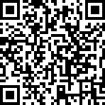
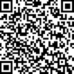

Donations
================

While PyInstaller is a voluntary project, the maintainers need to make their
living. Each day they spend on PyInstaller is missing for other, paid
projects. **So please help keeping PyInstaller alive.** Thanks!

* **PayPal:** `Donate
  <https://www.paypal.com/cgi-bin/webscr?cmd=_s-xclick&hosted_button_id=VK5QJFDCE8UW6>`_.
  If you want a bill, please leave your name, address and email-address.

* **BountySource:** https://www.bountysource.com/teams/pyinstaller

* **Bitcoin:** `1JUFjawzWDR7Tc8z9TKXstVFdjkDY9FbtK
  <bitcoin:1JUFjawzWDR7Tc8z9TKXstVFdjkDY9FbtK>`_

* **Ethereum:** `0xcefaac4c73b22c0343c93bd6fdaeb60240c14235
  <https://etherscan.io/address/0xcefaac4c73b22c0343c93bd6fdaeb60240c14235>`_

* **SEPA/bank-transfer:** If you want to donate via bank-transfer, e.g. SEPA,
  please drop me a note and I'll send you the account details. If you want a
  bill, please leave your name, address and email-address.

Sponsorship and  Project Grant
~~~~~~~~~~~~~~~~~~~~~~~~~~~~~~~~~~

Please consider sponsoring |PyInstaller| development, especially if your
company benefits from this project.

We welcome your patronage on Bountysource:

* Contribute a recurring amount to the team
* Place a bounty on a specific feature

Your contribution will go towards adding new features to |PyInstaller| and
making sure all functionality continues to meet our high quality standards.

A grant for contiguous full-time development has the biggest impact for
progress. Periods of 3 to 10 days allow a contributor to tackle substantial
complex issues which are otherwise left to linger until somebody can’t afford
to not fix them.

Contact `Hartmut Goebel <mailto:h.goebel@crazy-compilers.com>`_ to arrange a
grant for a core contributor.

Huge thanks to all the companies and individuals who financially contributed
to the development of |PyInstaller|. Please send a PR if you’ve donated and
would like to be listed on the web-site.

   Bitcoin address

   Ethereum address

.. include:: _common_definitions.txt
